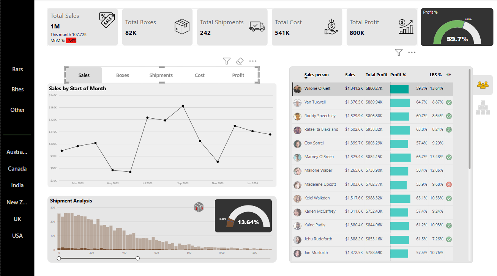
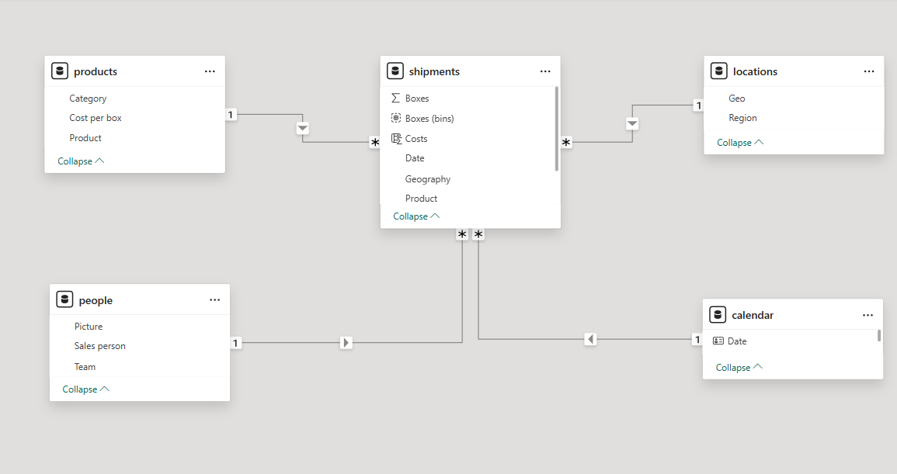
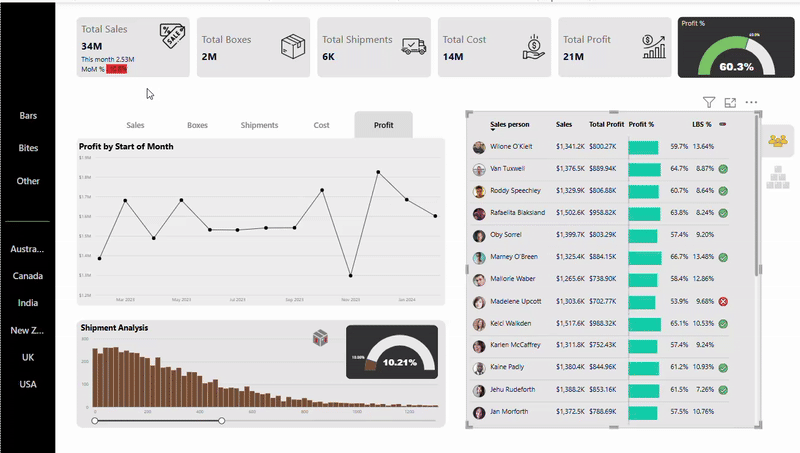

# 🍬 Candy Sales Analytics Dashboard – Power BI

 

This project showcases an interactive **Power BI dashboard** built to analyze sweet/candy product sales. It presents business-critical insights such as total revenue, profit margins, product trends, and country-level performance breakdowns.

## 📊 Key Features

- **Sales KPIs & Performance Tracking**  
  Track key sales metrics like revenue, profit, and quantity sold(boxes of sweets).

- **Dynamic Trend Analysis**  
  Implemented using **Field Parameters** to let users toggle between different metrics (e.g., sales, boxes, shipmets, cost, and profit) over time.

- **Gauge Charts for Visual Impact**  
  Clear visualization of **Profit %** and **LBS %** targets. (LBS - Low Box Shipments)

- **Interactive Bookmarks**  
  Created custom views with **bookmarks** for quick access to insights of sales persons and products.

- **Custom Tooltips**  
  Country-level breakdowns shown via **custom tooltip pages** for deeper insights.

---

## 🧠 Concepts & Techniques Used

- 📌 **Data Modelling** using the **Star Schema**
- 📌 Identification of **measures and KPIs** for sales analytics
- 📌 Creation of a **dedicated measure table** for DAX organization
- 📌 **Field Parameters** for a dynamic and user-friendly trend chart
- 📌 Use of **Gauge Charts** to monitor target achievements
- 📌 Application of **Bookmarks** for guided storytelling
- 📌 Integration of **Tooltips** for better UX and data granularity

---

## 🛠️ Tools & Technologies

- Microsoft **Power BI Desktop**
- Power Query
- DAX (Data Analysis Expressions)
- Star Schema Design Principles

---

## 🛠️ Data Model

 

---

## 📷 Demo

 

---

